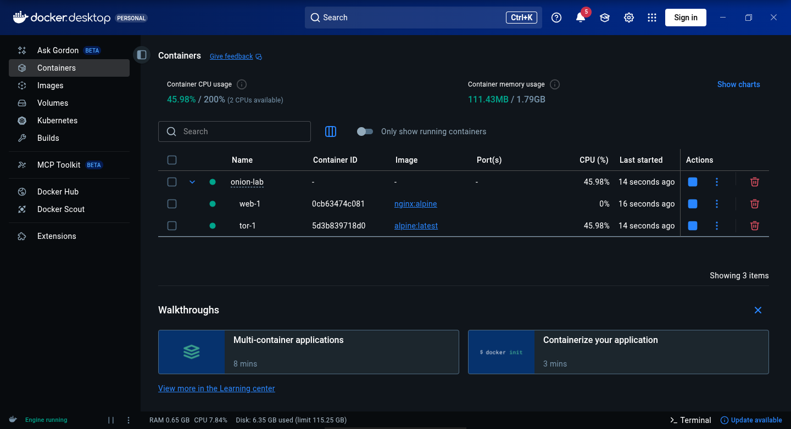
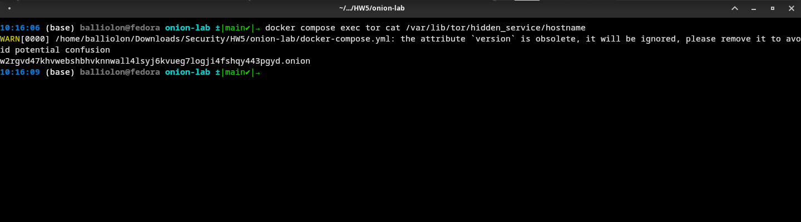
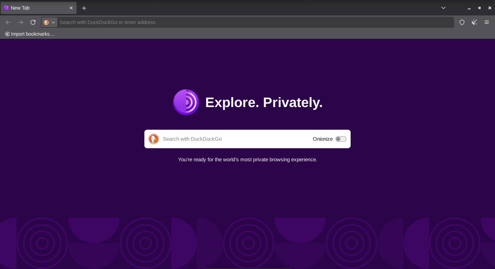
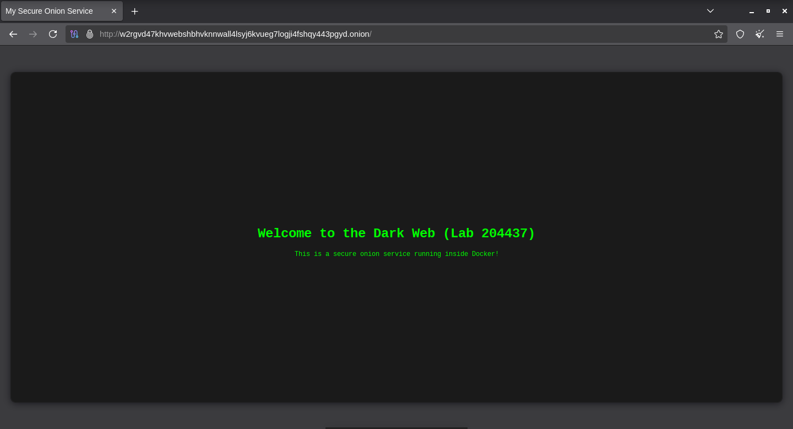

# onion-lab
This is for 204437 Computer System Security at Computer Engineering, Kasetsart University

---

1. Requirement ที่ใช้  
   1. Docker  
   2. Text Editor (Neovim)  
   3. Tor  
2. สร้าง Structure folder ดังนี้  
   1.   
   2. เตรียมไฟล์ Frontend: สร้างหน้าเว็บไซต์แบบ Static (index.html) เพื่อใช้เป็นหน้าแสดงผลหลัก  
   3. ตั้งค่าคอนฟิกูเรชันของ Tor: สร้างไฟล์ torrc โดยกำหนดค่า HiddenServiceDir เพื่อระบุตำแหน่งจัดเก็บข้อมูลเซอร์วิส และกำหนด HiddenServicePort 80 web:80 เพื่อทำ Reverse Proxy ส่งทราฟฟิกไปยังพอร์ต 80 ของ Web Container  
   4. กำหนดโครงสร้าง Docker Compose: สร้าง docker-compose.yml เพื่อรันคอนเทนเนอร์ 2 ตัว ได้แก่ web (ใช้ Nginx Image สำหรับให้บริการหน้าเว็บ) และ tor (ใช้ Alpine โหลดแพ็กเกจ Tor สำหรับเชื่อมต่อกับเครือข่าย Tor) โดยไม่เปิดพอร์ตออกสู่โฮสต์หลักเพื่อป้องกันการโจมตีจากภายนอก  
3. Run \`docker compose up \-d\` เพื่อดึง image และสร้าง Container แบบ Appliance  
   1.   
4. ดึง Onion Address ออกจาก tor ด้วย \`docker compose exec tor cat /var/lib/tor/hidden\_service/hostname\`  
   1. 
5. ติดตั้ง Tor (เนื่องจากผมใช้ fedora จึงติดตั้งผ่าน dnf)  
   1. 
6. ใช้ w2rgvd47khvwebshbhvknnwall4lsyj6kvueg7logji4fshqy443pgyd.onion ที่ได้มา เชื่อมต่อ แล้วดูว่าแสดงผล index.html ไหม  
   1.  
7. สรุป Onion Address: [w2rgvd47khvwebshbhvknnwall4lsyj6kvueg7logji4fshqy443pgyd.onion](http://w2rgvd47khvwebshbhvknnwall4lsyj6kvueg7logji4fshqy443pgyd.onion)

วิเคราะห์คุณสมบัติของ Onion Service

- Location hiding:  
  - บริการนี้สามารถปกปิด IP Address และตำแหน่งที่ตั้งที่แท้จริงของเซิร์ฟเวอร์ได้อย่างสมบูรณ์แบบ   
  - ทราฟฟิกไม่ได้วิ่งเป็นเส้นตรงจากผู้ใช้มายังเซิร์ฟเวอร์ แต่ Tor Service ของเราจะสร้างเส้นทางไปยัง "Rendezvous Point" ภายในเครือข่าย Tor เพื่อไปพบกับทราฟฟิกของผู้ใช้ที่นั่น ทำให้ทั้งฝั่งผู้ให้บริการและฝั่งผู้เยี่ยมชมต่างไม่รู้ IP Address ของกันและกัน นอกจากนี้ การใช้ Docker ยิ่งตอกย้ำความปลอดภัย เพราะ Web Server (Nginx) ทำงานอยู่ในเน็ตเวิร์กปิดและสื่อสารผ่าน Tor Container เท่านั้น  
- End-to-end authentication:  
  - ผู้ใช้งานสามารถมั่นใจได้ 100% ว่ากำลังเชื่อมต่อกับเซิร์ฟเวอร์ตัวจริง ไม่ได้ถูกสวมรอยหรือสกัดกั้น   
  - ชื่อโดเมน .onion ไม่ได้เกิดจากการสุ่มทั่วไป แต่เกิดจากการนำ Public Key ของเซอร์วิสเรามาเข้ารหัส (Hash) เมื่อผู้ใช้พิมพ์ที่อยู่นี้ Tor Protocol จะใช้หลักคณิตศาสตร์เชิงรหัสวิทยาเพื่อยืนยันว่าฝั่งเซิร์ฟเวอร์ของเรามี Private Key ที่จับคู่กันถูกต้องจริงๆ ทำให้ป้องกันการโจมตีแบบ Phishing หรือ DNS Spoofing ได้  
- End-to-end encryption:  
  - ข้อมูลทั้งหมดถูกเข้ารหัสตั้งแต่ต้นทางจนถึงปลายทาง โดยไม่จำเป็นต้องขอใบรับรอง SSL/TLS จากหน่วยงานภายนอก (CA)   
  - ข้อมูลจะถูกเข้ารหัสตั้งแต่ตอนที่ออกจาก Tor Browser ของผู้ใช้งาน และจะถูกถอดรหัสก็ต่อเมื่อเดินทางมาถึง Tor Client ที่รันอยู่ใน Docker Container ของเราเท่านั้น แม้แต่โหนดต่างๆ (Relays) ภายในเครือข่าย Tor ก็ไม่สามารถอ่านเนื้อหาของทราฟฟิกนี้ได้  
- NAT punching:  
  - สามารถให้บริการเว็บไซต์ได้โดยไม่ต้องเข้าไปตั้งค่า Port Forwarding ที่ Router หรือเจาะ Firewall   
  - ปกติการเปิดเซิร์ฟเวอร์ต้องรอรับการเชื่อมต่อขาเข้า (Inbound) ซึ่งมักจะติด NAT หรือ Firewall แต่ Tor Service ใช้กระบวนการสร้าง Outbound Connection ออกไปยังเครือข่าย Tor ด้วยตัวเอง ทำให้ระบบปฏิบัติการและ Router มองว่ามันเป็นเพียงทราฟฟิกขาออกทั่วไป จึงสามารถทะลุข้อจำกัดเรื่อง NAT ไปได้อย่างง่ายดาย

